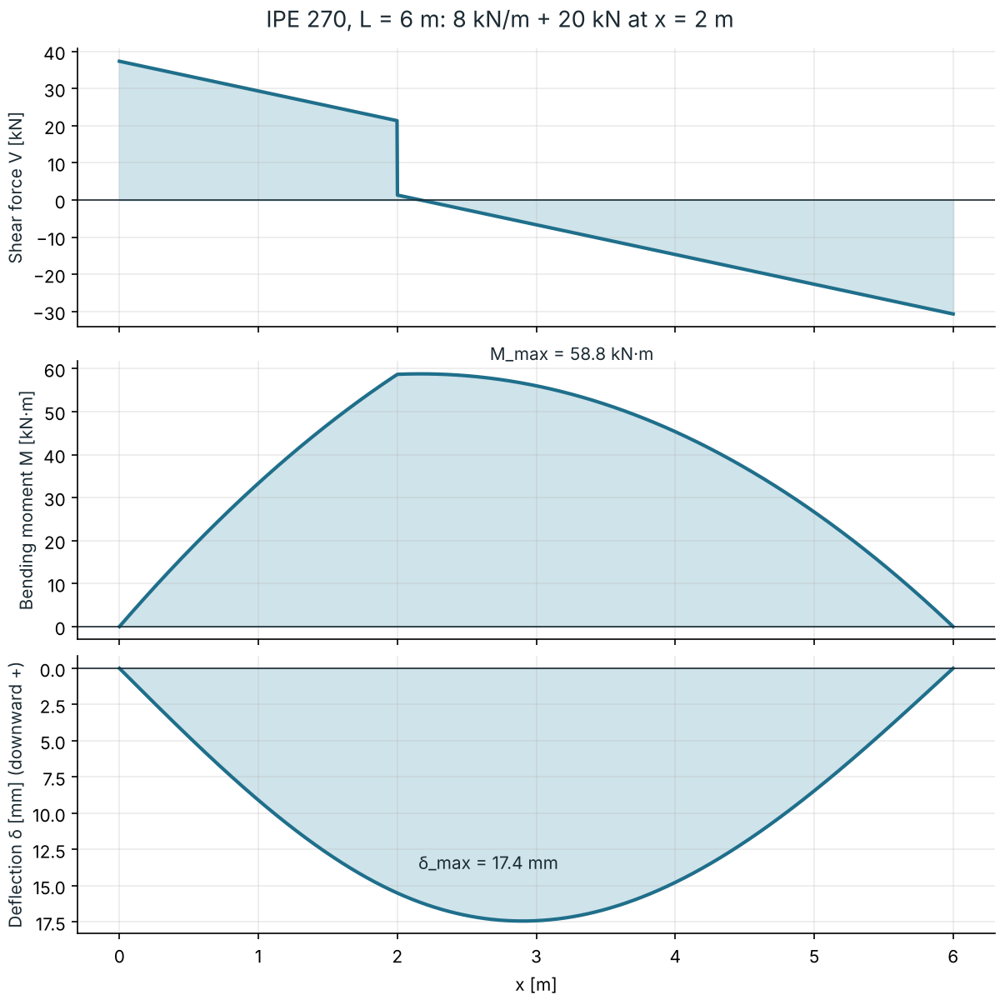
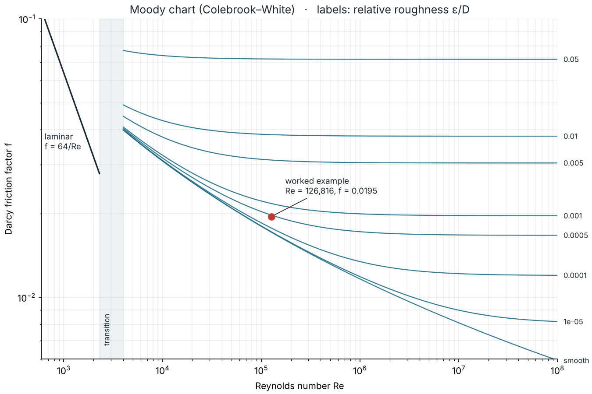

# mech-tools

Small, tested Python calculators for everyday mechanical engineering problems,
written by **George Chatzis**, Mechanical Engineer.

Every result is checked against closed-form textbook solutions. The tests run
automatically on GitHub for every change.

| Module | What it does |
|---|---|
| `mechtools.beam` | Simply supported and cantilever beams with any mix of point and uniform loads: reactions, shear force, bending moment and deflection (Euler–Bernoulli) |
| `mechtools.pipe` | Pipe flow: Reynolds number, Darcy friction factor (laminar / Colebrook–White / Haaland), Darcy–Weisbach pressure drop and head loss |

## Beam analysis

```python
from mechtools import Beam

beam = Beam(length=6.0, E=210e9, I=5790e-8)       # IPE 270, S235 steel
beam.add_uniform_load(8e3).add_point_load(20e3, a=2.0)
r = beam.solve()

r.reactions        # {'R_A': 37333.3, 'R_B': 30666.7}  N
r.max_moment       # 58 778  N·m
r.max_deflection   # 0.0174  m  -> L/344, passes the L/250 serviceability limit
```



The solver builds the bending moment from statics, then integrates the
curvature `M / EI` twice and applies the support conditions. It is checked
against these textbook cases:

| Case | Max deflection |
|---|---|
| Simply supported, central point load | PL³ / 48EI |
| Simply supported, uniform load | 5wL⁴ / 384EI |
| Simply supported, offset point load | Pb(L²−b²)^1.5 / (9√3·LEI) |
| Cantilever, end point load | PL³ / 3EI |
| Cantilever, uniform load | wL⁴ / 8EI |

## Pipe flow

```python
from mechtools import pressure_drop
from mechtools.pipe import ROUGHNESS

r = pressure_drop(flow_rate=0.010, diameter=0.100, length=100.0,
                  roughness=ROUGHNESS["commercial steel"])   # water at 20 °C
print(r.summary())
# Re = 126,816 (turbulent), f = 0.0195, V = 1.27 m/s, Δp = 15.78 kPa, h_f = 1.61 m
```



The Colebrook–White equation is solved iteratively, starting from the explicit
Haaland approximation. Tests compare it with Moody-chart reference values and
with the Blasius correlation for smooth pipes.

## Run it yourself

Requires Python 3.9+ with NumPy (and Matplotlib for the charts).

```bash
python -m unittest discover -s tests -v     # 12 tests
python examples/beam_example.py
python examples/moody_chart.py
```

## Roadmap

- Fixed–fixed and propped-cantilever beams
- Minor losses (bends, valves) and pipe networks
- Heat exchanger sizing with the LMTD and ε-NTU methods

## License

MIT
